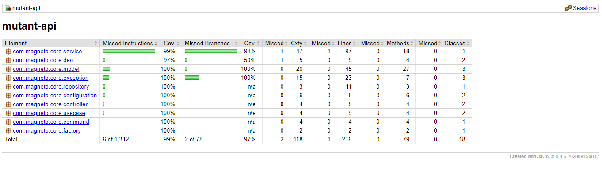
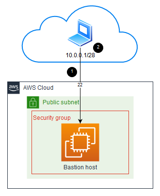

# Mutant API

<!-- TABLE OF CONTENTS -->
<details>
  <summary>Tabla de contenido</summary>
  <ol>
    <li>
      <a href="#Sobre-el-proyecto">Sobre el proyecto</a>
      <ul>
        <li><a href="#Tecnologías-utilizadas">Tecnologías utilizadas</a></li>
      </ul>
    </li>
    <li>
      <a href="#Guía-de-inicio">Guía de inicio</a>
      <ul>
        <li><a href="#prerequisitos">Prerequisitos</a></li>
        <li><a href="#instalación">Instalación</a></li>
      </ul>
    </li>
    <li>
        <a href="#test-de-la-aplicación">Test de la aplicación</a>
        <ul>
        <li><a href="#test-unitarios">Test Unitarios</a></li>
        <li><a href="#test-Integración">Test Integración</a></li>
      </ul>
    </li>
    <li><a href="#cobertura">Cobertura</a></li>
    <li><a href="#despliegue">Despliegue</a></li>
    <li><a href="#documentación">Documentación</a></li>
    <li><a href="#Colecciones-Postman-Local-Producción">Colecciones Postman Local - Producción</a></li>
  </ol>
</details>

<!-- ABOUT THE PROJECT -->
## Sobre el proyecto

Mutant API cumple con la función de verificar si un humano es un mutante o no por medio del ADN.

Consideraciones:

* Se considera que un ADN es mutante si se encuentra más de una secuencia de cuatro letras
  iguales, de forma oblicua, horizontal o vertical.

Está también cuenta con la posiblidad de consultar las estadísticas de los ADN verificados en la API.

### Tecnologías utilizadas:

* Java 11
* Sprint Boot
* Arquitectura Hexagonal
* CQRS
* Gradle 6.6
* MySql y H2
* Lombok
* Swagger
* JDBC
* Junit
* AWS: EC2 Y RDS

<!-- GETTING STARTED -->
## Guía de inicio

### Prerequisitos
```sh
  Java 11
  Gradle 6.6
  MySQL 8.0.23
  ```

### Instalación

1. Clonar el repositorio
   ```sh
   git clone https://github.com/manuelaoc/mutant-api.git
   ```
2. Importar el proyecto como Gradle en su editor de preferencia.

3. Correr la aplicación.

<!-- TEST -->
## Test de la aplicación

### Test Unitarios

* Para los test unitarios se utilizó JUnit4.

### Test Integración

* Para los test de integración se utilizo JUnit4, MockMVC y base de datos H2 embebida.

Para ejecutar los test de la aplicación, se debe correr el comando:
 ```sh
   gradlew test
   ```

<!-- COVERAGE -->
## Cobertura



<!-- DEPLOY -->
## Despliegue

El despliegue de la aplicación se realizó en el Cloud Computing AWS mediante el servicio de EC2.



<!-- DOCUMENTATION -->

## Documentación

A continuación se encuentra el enlace para acceder a la documentación de la API realizada con Swagger 

http://ec2-3-145-10-130.us-east-2.compute.amazonaws.com:8080/mutant/swagger-ui.html

## Colecciones Postman

En la carpeta `postman` se encuentra el archivo con la colección de consumos para realizar las pruebas al API de mutantes, con los diferentes escenarios que permiten
verificar la funcionalidad de esta.